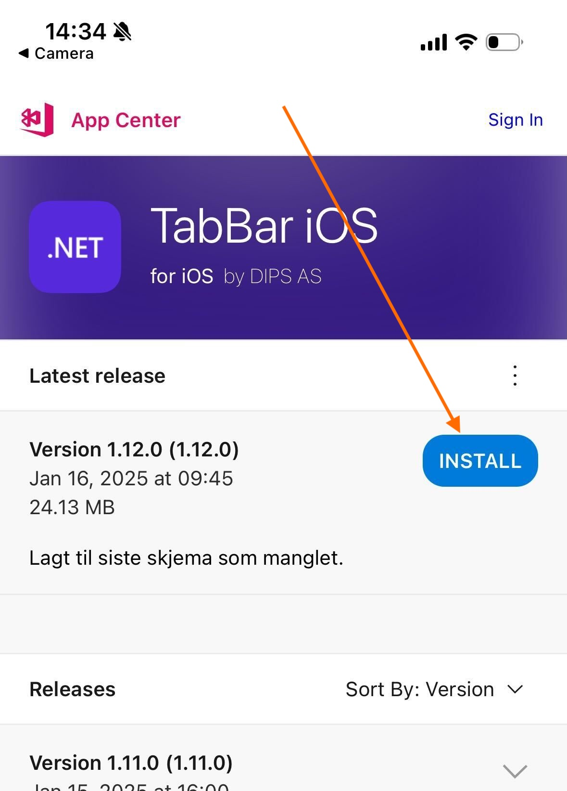
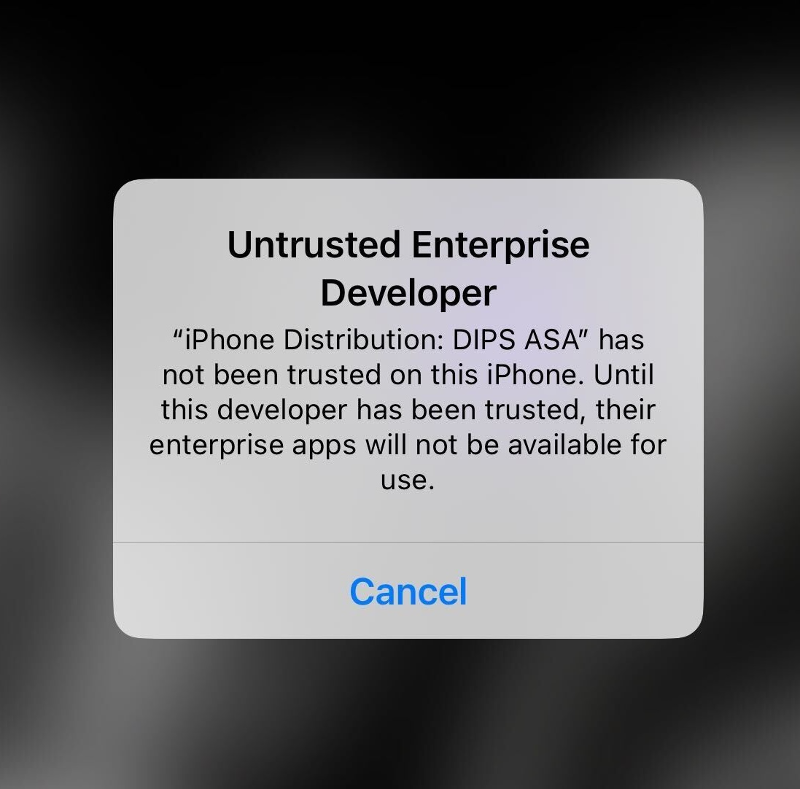
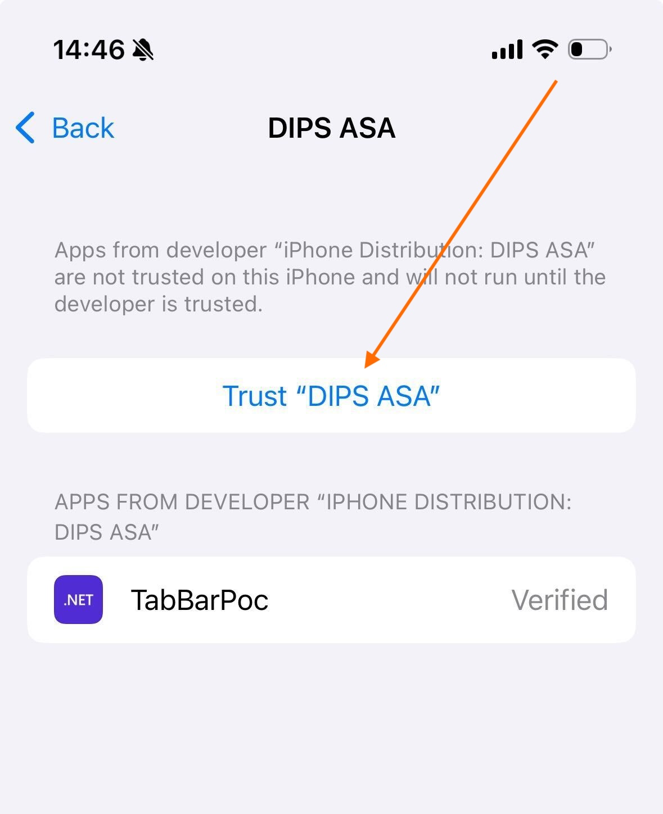

# Hvordan teste Tabbar POC.

> Etter du har fullført denne guiden vil telefonen din starte på nytt før du kan ta i bruk Tabbar appen.

## Last ned appen
Bruk denne QR koden:

Last ned siste versjonen:

## Godkjenn DIPS AS som utvikler av appen
Du må godkjenne DIPS AS som utviker for å starte appen. Dette er fordi du laster den ned fra en "usikker" kilde, altså ikke App Store. 

Dette gjør du ved å gå til **Innstillinger > Generelt > VPN og enhetsadministrasjon > DIPS ASA > Trust "DIPS ASA"**.

Telefonen din vil nå gjøre en omstart før du kan ta i bruk Tabbar appen.